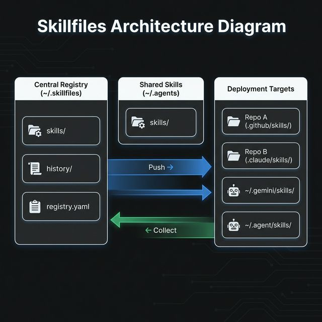

# Skillfiles

**Centrally manage AI agent skill definitions across all your repositories.**

Skillfiles lets you define agent behaviors (skill.md files) in one place and deploy them consistently to multiple repositories. Perfect for teams using GitHub Copilot, Claude, or other AI coding assistants.

## Architecture Overview



| Flow        | Description                                               |
| ----------- | --------------------------------------------------------- |
| **Push**    | Registry → Targets: Deploy skills with template expansion |
| **Collect** | Targets → Registry: Sync changes from repositories        |
| **Scope**   | `repo` = project-specific, `shared` = user-wide           |

## Features

### 🎯 Centralized Skill Registry

Define skills once in a central registry and push them to any repository. No more copy-pasting between projects.

### 🔄 Two-Way Sync

- **Push**: Deploy skills from registry to repositories
- **Collect**: Gather updates from repositories back to registry

### 📝 Template Variables

Use Handlebars templates to customize skills per repository:

```markdown
# {{REPO_NAME}} Guidelines

Owner: {{OWNER}}
```

### 🤖 Multi-Agent Support

Deploy the same skill to different AI agents with agent-specific configurations:

- GitHub Copilot (`.github/skills/`)
- Anthropic Claude (`.claude/skills/`)
- Google Gemini (`.gemini/skills/`)
- Standard Agent (`.agent/skills/`) - [agentskills.io](https://agentskills.io) standard
- Cursor, Windsurf, Cody, and more

### 📊 Version History

Automatic snapshots before every change. Roll back to any previous version with one click.

## Quick Start

1. **Install** the extension from VS Code Marketplace
2. **Open** the Skillfiles sidebar (look for the icon in the Activity Bar)
3. **Create** your first skill:
   - Click "Create New Skill" button
   - Enter a name (e.g., `code-review`)
   - Write your skill content in the SKILL.md file
4. **Add a target**:
   - Right-click your skill → "Add Target"
   - Select a repository and agent
5. **Push** to deploy:
   - Right-click your skill → "Push"
   - Confirm the deployment

## Extension Settings

| Setting                      | Description                                                    |
| ---------------------------- | -------------------------------------------------------------- |
| `skillfiles.registryPath`    | Path to your skill registry (default: `~/.skillfiles`)         |
| `skillfiles.sharedSkillRoot` | Path for shared skills (default: `~/.agents`)                  |
| `skillfiles.scanRoots`       | Directories to scan for repositories                           |
| `skillfiles.conflictPolicy`  | How to handle conflicts: `ask`, `preferRegistry`, `preferRepo` |

## Commands

Access via Command Palette (`Cmd+Shift+P` / `Ctrl+Shift+P`):

| Command              | Description                                     |
| -------------------- | ----------------------------------------------- |
| **Push Skill**       | Deploy skill to a target repository             |
| **Collect Skill**    | Import changes from repository back to registry |
| **Show Diff**        | Compare registry and deployed versions          |
| **Rollback**         | Restore a previous version from history         |
| **Bulk Push**        | Push all skills to all targets                  |
| **Bulk Collect**     | Collect all skills from all targets             |
| **Create New Skill** | Create a new skill in the registry              |
| **Open Audit Log**   | View all operations history                     |

## Requirements

- VS Code 1.108.0 or higher
- No external dependencies

## Privacy

Skillfiles is **completely local**. No data is sent to external servers. All operations happen on your filesystem.

## License

[MIT](LICENSE)
